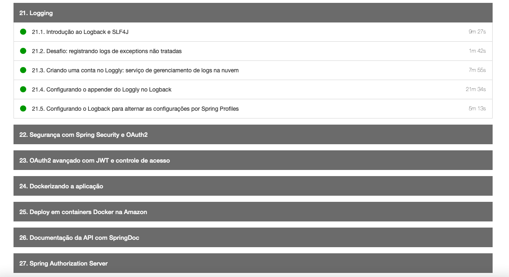
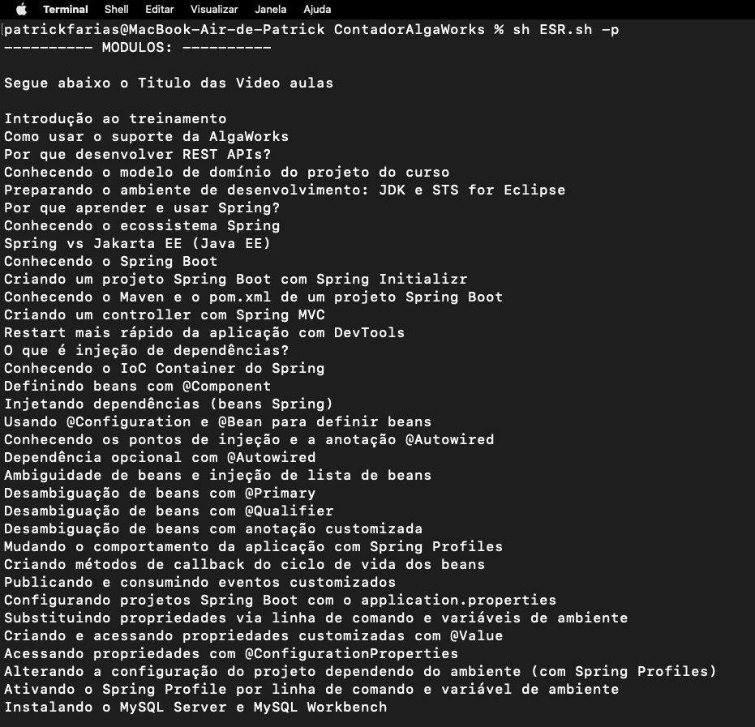
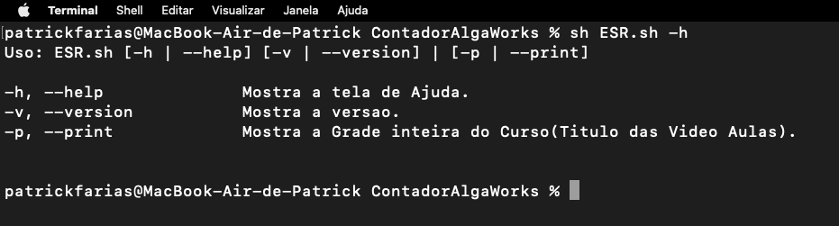
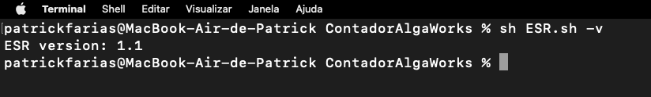

# Contador de Tempo das Vídeo Aulas.
> Curso ESR - Especialista Spring Rest (AlgaWorks) </br> [https://www.algaworks.com](https://www.algaworks.com)

## Descrição do Projeto:

Esse projeto tem por objetivo de forma didática utilizar o Shell Script para realizar um calculo de unidade de tempo e conversão em horas.</br>
Problema: A plataforma da AlgaWorks informa o tempo de cada aula individual de um determinado curso. Porém eu gostaria de saber o tempo total de todas as aulas de um determinado curso.</br>


Pegamos como exemplo o curso ESR - Especialista Spring Rest)</br>
Quantas horas em esse treinamento?
A plataforma não informa. Mas a partir de agora nós podemos ficar sabendo.

## Forma de Cálculo:
Esse script foi feito de forma didática, para facilitar o entendimento. 

Mas basicamente ele faz o seguinte:
</br> 1 - Pega o arquivo Fonte.html e separa as linhas que contem as referencias as aulas com os tempos [ <code>"c-course-curriculum__lesson-duration">24m 57s</code> ] e salva em um novo arquivo. Exemplo: linhas que contem informações nesse formato: 5m 22s, 12m 38s (Se tiver 200 aulas, teremos 200 referencias)
</br> 2 - Separa em um arquivo os minutos, um cada linha( uma linha com o 5, outra com o 12, e faz isso com todas as linhas do item 1)
</br> 3 - Soma as quantidades informadas dos minutos em cada linha do item 2 (Aqui ele usa a calculadora do Shell, ele faz uma mágica)
</br> 4 - Separa em um arquivo os segundos, um cada linha( uma linha com o 22, outra com o 38, e faz isso com todas as linhas do item 1)
</br> 5 - Soma as quantidades informadas dos segundos em cada linha do item 4 (Aqui ele usa a calculadora do Shell de novo)
</br> 6 - Converte a soma dos segundos em minutos.(vai sobrar alguns segundos dessa conversao)
</br> 7 - Soma o resultado do item 6 com minutos do item 3.
</br> 8 - Converte a soma do item 7 em horas.
</br> 9 - Agora vc ja tem as horas, os minutos e os segundos que restaram da conversão do item 6.


## Exemplo de Uso:

Faça o clone:
> git clone https://github.com/patrickfarias/ShellScript.git

Para utilizar o script, basta ter o bash instado em sua máquina.
Para SO Mac/Linux o Bash já vem instalado e pode ser utilizado pelo terminal.
Caso seja usuário da Sistema Windows, Se desejar, instale o bash conforme orientação disponível no blog da Microsoft: https://learn.microsoft.com/pt-br/windows/wsl/install

Após o terminal estar devidamente configurado.
Estando no diretório _./ShellScript/ContadorAlgaWorks_, basta rodar o seguinte comando:

```
sh ESR.sh
```


Lembrando que: Temos tambem a possibilidade de passar parâmetros:
```
sh ESR.sh -p ou sh ESR.sh --print   // Mostra a Grade inteira do Curso(Titulo das Video Aulas).
```



```
sh ESR.sh -h ou sh ESR.sh --help    // Mostra a tela de Ajuda.
```

```
sh ESR.sh -v ou sh ESR.sh --version // Mostra a versao.
```


</br>

## Será que funciona?
[](https://youtu.be/vt5fpE0bzSY)

## Será que funciona?

Para validar se o script está realmente funcional.

Entre dentro do arquivo _./ShellScript/ContadorAlgaWorks/Fonte.html_ e altere algum campo com com esse formato
e altere por exemplo uma linha como essa:

DE:<br>
<code>"c-course-curriculum__lesson-duration">24m 57s</code>

PARA:<br>
<code>"c-course-curriculum__lesson-duration">23m 55s</code>

e salve o arquivo Fonte.html.

Rode o script novamente, como foi alterado o tempo informado como sendo de 1 minuto e 2 segundos a menos.
O Resultado final deve dar 1 minuto e 2 segundo a menos no total informado no relatorio.

Brinque com outros valores e comprove.

> ATENCAO: Esse recurso vale para outros cursos da AlgaWorks, se for aluno, basta entrar na pagina do seu curso com o seu usuario e senha, e copiar o fonte da pagina do curso que vc quiser calcular o tempo e colar no arquivo ./Fonte.html e rodar o script, que ele vai calcular o tempo total do curso. </br> Nao esqueça de salvar o arquivo.


## Histórico de Releases:
* 1.1
    * 2022-10-30 - Patrick Farias
    * Adicionado Add parametros: [-h | --help] [-v | --version]  [-p | --print]
   
* 1.0
    * Start (2020-12-30)

## Contato

Patrick Farias – patrickfarias@icloud.com –
(34)99304-0500

[https://github.com/patrickfarias/ShellScript](https://github.com/patrickfarias/ShellScript)