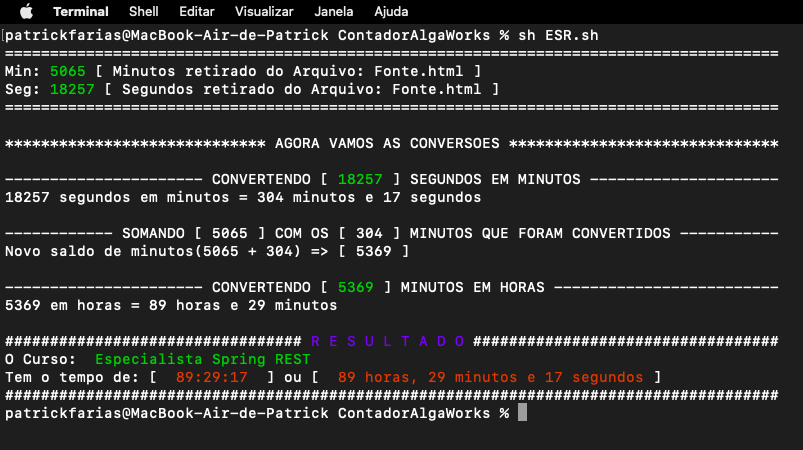

# Contador de Tempo das Video Aulas.
> Curso ESR - Especialista Sping Rest (AlgaWorks)

## Exemplo de Uso:

Para utilizar o script, basta ter o bash instado em sua máquina.

No diretorio _ContadorAlgaWorks_, basta digitar:

```sh
sh ESR.sh
```


## Histórico de Releases:
* 1.1
    * 2022-10-30 - Patrick Farias
    * Adicionado Add parametros: [-h | --help] [-v | --version]  [-p | --print]
   
* 1.0
    * Start (2020-12-30)

## Contato

Patrick Farias – patrickfarias@icloud.com –
(34)99304-0500

[https://github.com/patrickfarias/ShellScript](https://github.com/patrickfarias/ShellScript)
